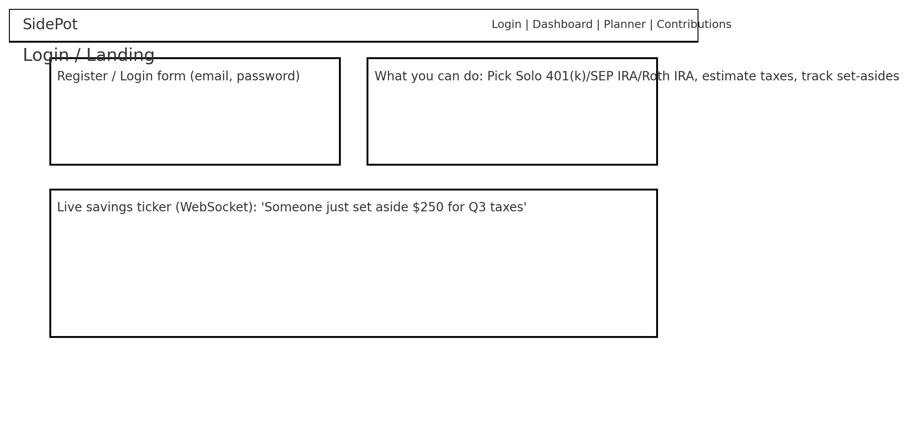
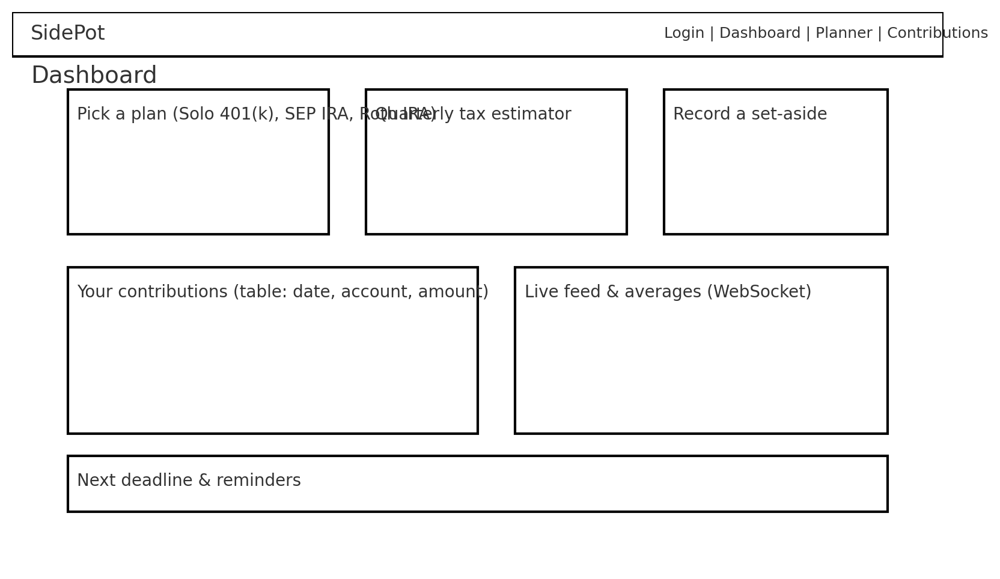
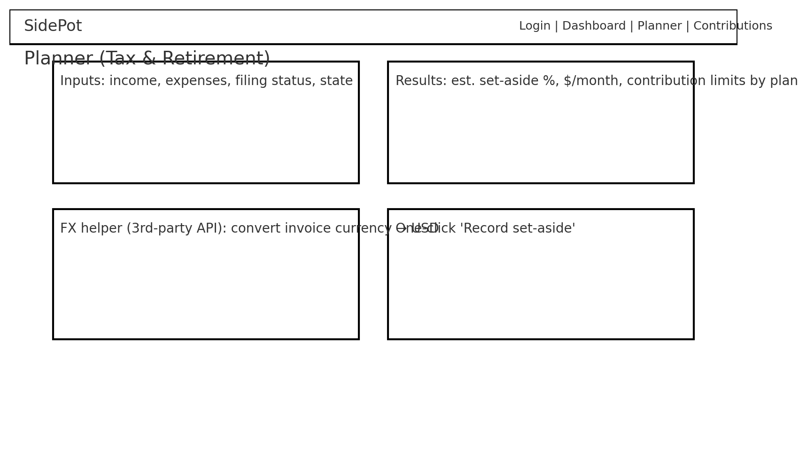
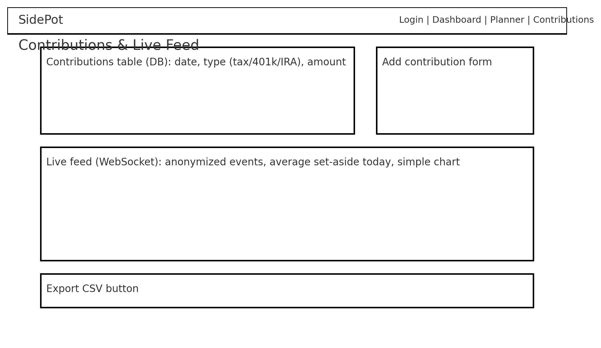

# Side Pot - I love web programming

---

## Specification Deliverable

### Elevator pitch
When you’re self-employed, paychecks don’t automatically withhold taxes or fund retirement. **Side Pot** makes it simple: enter income and expenses to get a **monthly tax set-aside estimate**, see **basic contribution limits** for **Solo 401(k)**, **SEP IRA**, and **Roth IRA**, and **record what you actually set aside**. A small **real-time savings feed** (anonymized) shows others saving too, keeping you motivated.

> **Class disclaimer:** Educational demo only. **Not** tax or investment advice.

---

### Design

#### Mock

**Login / Landing**

**Dashboard**

**Planner (Tax & Retirement)**

**Contributions & Live Feed**

#### Interaction overview (sequence)
User → Frontend (React) → Backend (Express):
1. Register/Login (JWT in HTTP-only cookie)
2. Planner: POST `/api/planner/estimate` → returns `{percent, monthlySetAside}`
3. Contributions: GET/POST/DELETE `/api/contributions`
4. FX Helper: GET `/api/fx?base=EUR&amount=1000` (server calls free FX API)
5. WebSocket: server emits `savings_event` → clients update live ticker

---

### Key features
- Secure login (register/login/logout) over HTTPS
- **Tax set-aside estimator** (simple class formula; not advice)
- **Plan picker** with concise notes: Solo 401(k), SEP IRA, Roth IRA
- **Contribution tracker** for taxes and retirement accounts
- **Live savings feed** (WebSocket): “Someone just set aside $X”
- **3rd-party API**: FX conversion helper for foreign invoices (server-side proxy)

---

### Technologies
I am going to use the required technologies in the following ways:

- **HTML** – Semantic app shell with accessible forms (labels, inputs, buttons).
- **CSS** – Mobile-first responsive layout, good whitespace/contrast, small hover/active animations.
- **React** – Components & routing for:
  - `/` (Login), `/dashboard`, `/planner`, `/contributions`
  - State for auth, planner inputs/results, contributions, WebSocket feed.
- **Service (backend)** – Node/Express endpoints:
  - **Auth**: `POST /api/auth/register`, `POST /api/auth/login`, `POST /api/auth/logout`
  - **Planner**: `POST /api/planner/estimate` (deterministic classroom formula), `GET /api/planner/limits` (static cards)
  - **Contributions**: `GET /api/contributions`, `POST /api/contributions`, `DELETE /api/contributions/:id`
  - **3rd-party API**: `GET /api/fx?base=EUR&amount=1000` (server fetch to free FX API; demonstrates a service I didn’t write)
- **DB/Login** – Persist users (with bcrypt hash), profiles, and contributions (MongoDB/PostgreSQL, or a simple JSON DB for class). Register & login users; restrict contribution routes to authenticated users.
- **WebSocket** – Broadcast `savings_event` when contributions are added so all connected clients update their live ticker in real time.

## Service deliverable

For this deliverable I added a Node.js/Express backend that serves the frontend and provides the application's API.

- [x] **Node.js/Express HTTP service** - [service/index.js](./service/index.js) creates an Express app (run with `npm start`) listening on port 4000, with JSON body parsing and cookie-based auth tokens.
- [x] **Static middleware for frontend** - `app.use(express.static('public'))` serves the built React bundle, with an SPA fallback that returns `index.html` for client-side routes.
- [x] **Calls third party service endpoints** - The backend proxies dogapi.dog via `GET /api/dogfact`; the About page's [DogFact.jsx](./src/about/DogFact.jsx) calls our own endpoint instead of the third party directly.
- [x] **Backend provides service endpoints** - Auth (`POST /api/auth/register`, `POST /api/auth/login`, `POST /api/auth/logout`, `GET /api/auth/me` with bcrypt-hashed passwords and httpOnly cookie tokens), plus authenticated `GET/POST /api/planner` and `GET/POST /api/contributions` (in-memory until the database milestone).
- [x] **Frontend calls service endpoints** - Login/register in [Index.jsx](./src/index/Index.jsx) (mocks removed), session restore in [App.jsx](./src/App.jsx), planner items in [Planner.jsx](./src/planner/Planner.jsx), and contributions in [Contributions.jsx](./src/contributions/Contributions.jsx) all use `fetch` against the service.

## React part 2

For this deliverable I made the application fully reactive with React hooks, implementing every feature or mocking it out where the backend service is not deployed yet.

- [x] **All functionality implemented or mocked out** - Login/register works against `/api/auth/*` and falls back to a mocked local session (persisted in `localStorage`) until the service milestone; `/Dashboard`, `/Planner`, and `/Contributions` are protected routes that redirect unauthenticated visitors to the login page via a `PrivateRoute` component. Contributions load from `/api/contributions` in a `useEffect` and fall back to `localStorage`, so recorded contributions survive a refresh; adding a row updates state and attempts a `POST`. CSV export generates a download link managed by React state (no direct DOM manipulation). The dashboard's plan picker and quarterly tax estimator are controlled inputs — the estimator computes the set-aside from income and percentage, and the plan choice persists. The live WebSocket feed in [Dashboard.jsx](./src/dashboard/Dashboard.jsx) connects with cleanup on unmount, and [DogFact.jsx](./src/about/DogFact.jsx) calls a third-party API.
- [x] **Hooks** - `useState` drives auth state, panel/menu visibility, forms, the estimator, and the contributions table; `useEffect` handles the auth check on load, data fetching with fallback, the WebSocket lifecycle (with a cleanup function), object-URL cleanup for CSV export, and the third-party dog-fact fetch.

## React part1

For this deliverable I converted the application into a React single page application bundled by Vite, with client-side routing between components.

- [x] **Bundled using Vite** - The app builds with `npm run build` from [vite.config.js](./vite.config.js), with the entry point in [index.html](./index.html) loading [src/main.jsx](./src/main.jsx).
- [x] **Components** - Each page of the app is a functional React component: [Index](./src/index/Index.jsx) (login/landing), [Dashboard](./src/dashboard/Dashboard.jsx), [Planner](./src/planner/Planner.jsx), [Contributions](./src/contributions/Contributions.jsx), and [About](./src/about/About.jsx). The shared header (with nav and login state) and footer live once in [App.jsx](./src/App.jsx) instead of being duplicated per page.
- [x] **Router** - [App.jsx](./src/App.jsx) uses `react-router-dom`'s `BrowserRouter`, with `<NavLink>` elements in the nav and a `<Routes>` block mapping `/`, `/Dashboard`, `/Planner`, `/Contributions`, and `/About` to their components.

## CSS Deliverable

For this deliverable I styled the application into its final appearance.

- [x] **Header, footer, and main content body** - Every page shares a consistent header with the SidePot wordmark, a boxed navigation bar, a grid `main` content area, and a footer with attribution and the GitHub link. Shared styles live in `main.css`; page-specific styles live in `index.css`, `dashboard.css`, `planner.css`, and `contributions.css`.
- [x] **Navigation elements** - The nav is a flex `<ul>` of pill-shaped links sized with padding and `em` units (no fixed pixel widths), with hover and focus states and the current page highlighted in blue via `a[href$="..."]` selectors.
- [x] **Responsive to window resizing** - Layouts use CSS Grid with `minmax()` and `clamp()` for type; two-column grids collapse to one column under 720px (900px for the planner card grid), and the site respects the user's system theme with `prefers-color-scheme` dark mode across all pages.
- [x] **Application elements** - Cards, collapsible dashboard panels, dropdown menus, pills, and buttons are styled consistently with shared radii, borders, shadows, and hover/active transitions.
- [x] **Application text content** - Consistent system font stack, `clamp()`-scaled headings, tabular numerals for money values, and muted secondary text colors.
- [x] **Application images** - The hero image and footer images are responsive (`max-width: 100%`) with rounded corners, borders, and soft shadows.

## HTML Deliverable

### 📄 Overview
This commit includes the foundational HTML structure for the **SidePot** application — a self-employed planner for taxes and retirement contributions. The layout is based on wireframes and assignment specifications, and provides semantic structure, multi-page navigation, and placeholders for future functionality.

---

### ✅ What Was Added

#### 🔹 `index.html` (Homepage)
- Welcome message and login/register form
- Platform overview with feature explanation
- Hero image with descriptive `alt` text (`hero-tax-planner.jpg`)
- Navigation menu linking to other pages
- GitHub repo prominently linked in footer
- Placeholder: WebSocket savings ticker in `
`
- Placeholder: Display of user email after login

#### 🔹 `dashboard.html`
- Placeholder UI for plan selection (Solo 401(k), SEP IRA, Roth IRA)
- Quarterly tax estimator
- Contribution table (DB placeholder)
- WebSocket live feed
- Next deadline and reminder sections

#### 🔹 `planner.html`
- Inputs: income, filing status, state, expenses
- Estimated set-aside percentage and plan limits
- 3rd-party API placeholder for FX conversion
- "Record set-aside" interface stub

#### 🔹 `contributions.html`
- Contribution form and table (database placeholder)
- Live feed of anonymized activity (WebSocket placeholder)
- Button to export contributions as CSV

### ✅ Rubric Checklist

- [x] **HTML pages** - Four pages, one for each component of the application: `index.html` (login / landing), `dashboard.html`, `planner.html`, and `contributions.html`.
- [x] **Proper HTML tags** - Every page uses `<!DOCTYPE html>`, `<html lang="en">`, `<head>`, and `<body>`, with semantic structure throughout: `<header>`, `<nav>`, `<main>`, `<section>`, `<form>`, `<table>`, and `<footer>`.
- [x] **Character set and viewport** - Each page declares `<meta charset="utf-8">` and `<meta name="viewport" content="width=device-width, initial-scale=1">`.
- [x] **Navigation / links** - A shared `<nav>` links every page to the other three, and the footer links out to the GitHub repository for this project.
- [x] **Text** - Descriptive text on every page explaining the tax set-aside estimate, the retirement plan comparison cards, and the contribution history.
- [x] **Images** - `hero-tax-planner.jpg` on the landing page, with descriptive `alt` text.
- [x] **Login placeholder** - `index.html` contains an accessible register / login form built from `<label>` and `<input>` pairs for email and password. The logged-in user's name is shown in the header of the other pages.
- [x] **Database data placeholder** - `contributions.html` shows a `<table>` of recorded contributions that will later be loaded from the database.
- [x] **WebSocket placeholder** - The live savings ticker lives in `
` on `dashboard.html` and displays placeholder "Someone just set aside \$X" events.
- [x] **3rd party service placeholder** - The FX conversion helper on `planner.html`, with a placeholder result that the server-side call to the free FX API will fill in.
- [x] **Application logic placeholder** - Static example values for the monthly set-aside percentage and dollar amount, which `POST /api/planner/estimate` will compute later.
